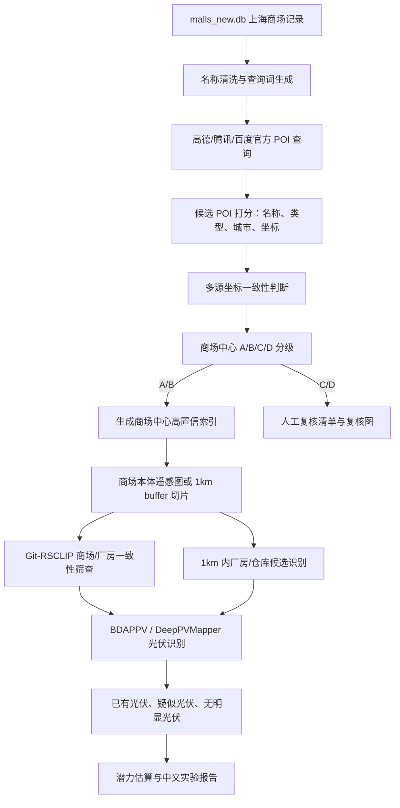

# 商场光伏潜力项目完整技术路线（截至 2026-07-09）

## 1. 项目目标

本项目的目标不是简单判断“某张商场图里有没有光伏”，而是建立一套可复核、可扩展的流程：

1. 精准确认上海商场主体中心点。
2. 基于高置信商场中心，生成商场及周边 1km 研究范围。
3. 识别商场自身屋顶和周边厂房/仓库屋顶上的已有光伏。
4. 评估商场中心 1km 内厂房/仓库屋顶的光伏铺设条件。
5. 输出带置信等级、复核清单、实验记录和结果表的技术成果。

项目定位为“商场及周边 1km 厂房/仓库屋顶光伏潜力初筛与复核系统”，不是完全自动的投资级测算系统。所有低置信样本必须进入人工复核，不直接用于正式统计。

## 2. 当前项目结构

```text
C:\PV
  malls_new.db
  config
    api_keys.local.json
    api_keys.local.example.json
  datasets
    shanghai_malls_satellite
      images
  docs
    商场周边1km厂房光伏潜力技术路线.md
    商场光伏潜力项目完整技术路线_截至20260709.md
  Git-RSCLIP
  outputs
    experiments
      20260708_raw_bdappv_test
      20260708_relocate_mall_centers
      20260708_gitr_sclip_poi_review
      poi_check_20260708_174544
  scripts
    satellite_pv
      run_official_poi_identity_validation.py
      run_gitr_sclip_poi_review.py
      run_clip_mall_consistency.py
      make_mall_poi_review_gallery.py
      prepare_mall_1km_buffer_tiles.py
      relocate_mall_centers.py
      finalize_mall_center_relocation.py
```

真实 API key 存放在 `C:\PV\config\api_keys.local.json`，该文件已加入忽略列表，不应提交或写进实验报告。

## 3. 数据现状

| 项目 | 当前状态 |
| --- | --- |
| 数据库 | `C:\PV\malls_new.db` |
| 上海商场记录 | 706 条 |
| 原始遥感图片 | `C:\PV\datasets\shanghai_malls_satellite\images` |
| 原始图片数量 | 706 张 |
| Git-RSCLIP 模型 | `C:\PV\Git-RSCLIP` |
| GPU 环境 | RTX 4090，torch CUDA 环境已验证 |

数据库里的 `location` 字段不能直接作为商场中心。它常见问题包括：

- 地址是路口、地铁站、项目地址、附近 POI，而不是商场主体。
- 同名/近名 POI 被误匹配。
- 建设中项目、TOD 项目、地块类项目容易落到道路或站点。
- 一些记录缺地址或地址粒度过粗。

因此，正式路线已经改为：不再依赖原 `location` 直接取图，而是重新通过官方 POI API 定位商场主体中心。

## 4. 为什么旧数据集会出现“不像商场主体”

旧数据集生成逻辑大致是：

```text
数据库商场记录
  -> 使用 name/location 做地理编码或已有坐标
  -> 以坐标为中心下载卫星图
  -> 形成 706 张上海商场遥感图
```

问题来自第一性原理：遥感图像中心点是否正确，完全取决于地理定位点是否代表“商场建筑主体中心”。如果定位点是道路、地铁口、停车场、地块入口、项目展示厅、办公区或附近店铺，那么下载的卫星图即使清晰，也不是目标商场主体。

所以，视觉模型只能回答“图像像不像商场/厂房/光伏”，不能单独证明“这就是数据库里那个商场”。商场身份确认必须由官方 POI 名称、类型、坐标、多源一致性和人工复核共同完成。

## 5. 总体技术路线



核心原则：

- 中心定位和光伏识别分层处理。
- A/B 级中心才允许进入正式 1km 分析。
- C/D 级只进入人工复核，不进入正式统计。
- 所有脚本输出时间戳实验目录，不覆盖原图和原 CSV。

## 6. 官方 POI 高置信商场中心

当前主脚本：

```text
C:\PV\scripts\satellite_pv\run_official_poi_identity_validation.py
```

已接入：

- 高德 Web 服务：`place/text`
- 腾讯位置服务：`place/v1/search`
- 百度 Place Search：脚本已预留 `BAIDU_MAP_AK`，可作为第三源裁判

配置文件：

```json
{
  "AMAP_WEB_KEY": "...",
  "TENCENT_MAP_KEY": "...",
  "BAIDU_MAP_AK": ""
}
```

当前小批量验证结果：

```text
实验目录：C:\PV\outputs\experiments\poi_check_20260708_174544
样本数：20
高德候选：187
腾讯候选：182
A 级 auto_pass：15
C 级 manual_review：5
可进入 1km 分析：15
暂不进入 1km 分析：5
```

5 条 C 级样本：

| mall_id | 名称 | C 级原因 |
| --- | --- | --- |
| 42 | 上海真如环宇城MAX | 两源未在 150m 内达成一致 |
| 73 | 上海华之门徐汇华泾TOD项目 | 坐标证据弱或有争议 |
| 181 | 上海置地西岸金融城 | 单源强候选，需复核主体中心 |
| 197 | 上海LOVE@大都会 | 单源强候选，需复核主体中心 |
| 210 | 上海聚峰中心 | 单源强候选，需复核主体中心 |

## 7. A/B/C/D 分级规则

当前代码逻辑：

```text
identity_status=auto_pass     -> A/B
identity_status=manual_review -> C
identity_status=reject        -> D
```

A 级：

- 名称强匹配。
- 至少两个官方源坐标在默认 150m 半径内一致。
- 图像证据暂缺或候选中心图像像商场。
- 可进入 1km 分析。

B 级：

- 名称强匹配。
- 单源强候选或多源一致。
- Git-RSCLIP 图像证据支持候选中心像商场。
- 可进入分析，但需要抽检。

C 级：

- 进入 `manual_review`。
- 常见原因是两源坐标不一致、名称弱匹配、坐标证据 `weak_or_disputed`、候选像入口/办公区/项目展示厅/内部 POI。
- 不进入正式 1km 分析。

D 级：

- 无可用官方 POI。
- 候选明显不是商场，或不在上海。
- 阻断，不进入后续流程。

## 8. API 使用策略

当前腾讯日调用量和并发额度有限，必须省着用。

推荐策略：

```text
高德 + 腾讯：全量主流程
百度：只补跑 C 级争议样本
```

省额度参数：

```powershell
--max-queries 1
--delay 1.5
--rate-limit-retries 0
```

继续跑下一批时使用 `--offset`，避免重复消耗前面已跑样本：

```powershell
C:\PV\PV\Scripts\python.exe C:\PV\scripts\satellite_pv\run_official_poi_identity_validation.py `
  --offset 20 `
  --limit 80 `
  --output-dir C:\PV\outputs\experiments\poi_check `
  --flat-timestamp `
  --max-queries 1 `
  --delay 1.5 `
  --rate-limit-retries 0 `
  --log-every 1
```

如果要用百度补跑 C 级：

```powershell
C:\PV\PV\Scripts\python.exe C:\PV\scripts\satellite_pv\run_official_poi_identity_validation.py `
  --ids 42,73,181,197,210 `
  --output-dir C:\PV\outputs\experiments\poi_baidu_review `
  --flat-timestamp `
  --max-queries 1 `
  --delay 1.5 `
  --rate-limit-retries 0 `
  --log-every 1
```

## 9. CLIP / Git-RSCLIP 视觉复核

模型位置：

```text
C:\PV\Git-RSCLIP
```

脚本：

```text
C:\PV\scripts\satellite_pv\run_gitr_sclip_poi_review.py
C:\PV\scripts\satellite_pv\run_clip_mall_consistency.py
```

作用：

- 判断旧图像和官方 POI 候选中心图像哪个更像商场/商业综合体。
- 发现道路、住宅、地铁站、施工地、空地、园区等非商场图像。
- 生成复核联系图和 CSV，不删除、不移动原图。

注意：CLIP 只作为视觉证据，不作为商场身份真值。最终身份仍以官方 POI 多源一致性和人工复核为准。

## 10. 光伏识别实验

已完成原始 706 张图片的 BDAPPV 初测：

```text
实验目录：C:\PV\outputs\experiments\20260708_raw_bdappv_test
输入图片：706
likely_pv：29
possible_pv：58
no_clear_pv：619
```

重要结论：

- 这次初测只能证明光伏模型能跑通，不应作为正式覆盖率统计。
- 原始 706 图中存在不少非商场主体图，光伏误检和错位统计风险较高。
- 后续正式光伏实验必须以 A/B 级商场中心或人工复核通过中心为输入。

正式路线：

1. 对 A/B 级商场中心重新生成商场主体图。
2. 对候选图跑 Git-RSCLIP 商场一致性筛查。
3. 对质量通过图跑 BDAPPV / DeepPVMapper。
4. 高分候选生成 mask、overlay、联系图。
5. 输出 `likely_pv / possible_pv / no_clear_pv`，并保留中文实验报告。

## 11. 商场中心 1km 厂房/仓库光伏潜力

脚本：

```text
C:\PV\scripts\satellite_pv\prepare_mall_1km_buffer_tiles.py
```

准入条件：

- 只接受 `can_enter_1km_analysis=1` 的 A/B 中心。
- C/D 中心默认不进入 1km 分析。
- 若强制使用临时中心，必须显式标注为 provisional，不进入正式统计。

1km 分析流程：

```text
A/B 商场中心
  -> 生成 1km buffer tile index
  -> 下载/缓存卫星切片
  -> Git-RSCLIP 筛选 factory / warehouse / logistics roof
  -> 剔除住宅、道路、公园、学校、普通商场屋顶
  -> BDAPPV / DeepPVMapper 识别已有光伏
  -> 估算可铺设屋顶面积与容量
  -> 生成商场级 1km 光伏潜力报告
```

厂房/仓库识别建议：

- 优先使用遥感视觉 + 语义筛查。
- 如果后续能拿到建筑轮廓，再用 footprint 约束屋顶边界。
- 对规则矩形大屋面、物流园、产业园、仓储园区优先评分。
- 对住宅小区、学校、医院、公园、道路、停车场单独负向过滤。

## 12. 潜力估算口径

初筛级估算公式：

```text
usable_area_mid = roof_area_m2 * usable_ratio_mid - existing_pv_area_m2
capacity_mid_kwp = usable_area_mid * capacity_density_mid
annual_generation_mid_kwh = capacity_mid_kwp * local_specific_yield
```

默认参数建议：

| 参数 | 建议值 |
| --- | --- |
| 大型平屋顶 usable_ratio_mid | 0.65 |
| 彩钢瓦坡屋顶 usable_ratio_mid | 0.55 |
| 复杂屋顶 usable_ratio_mid | 0.35 |
| capacity_density_mid | 0.15 kWp/m2 |

正式输出必须包含：

- `low / mid / high` 三档估计。
- `uncertainty_level`。
- 已有光伏面积与可新增潜力分开统计。
- 人工复核状态。

## 13. 当前主要问题

1. 官方 POI 全量还没跑完，只完成 20 条小批量验证。
2. 百度尚未加入实际运行，可作为 C 级样本第三源裁判。
3. 报告模板部分历史文件名曾出现乱码，需要后续统一修复中文报告生成。
4. 原始遥感数据集不能直接作为正式商场主体数据集。
5. 1km 厂房/仓库候选识别尚未正式跑通。
6. 光伏识别模型已跑通，但正式统计必须等高置信中心完成。

## 14. 下一步工作

优先级 1：继续官方 POI 中心确认。

- 用高德 + 腾讯按批次跑完 706 条。
- 每批使用 `--offset`，避免重复消耗 API。
- 汇总各批 `mall_center_resolved.csv`。
- C 级样本使用百度或人工复核补强。

优先级 2：生成高置信中心数据集。

- A 级直接进入正式中心索引。
- B 级进入中心索引但标记抽检。
- C/D 输出复核清单和复核图。

优先级 3：重建正式遥感图数据集。

- 以 A/B 中心重新下载商场主体图。
- 对照旧图和新图生成复核联系图。
- Git-RSCLIP 过滤明显非商场图。

优先级 4：正式光伏实验。

- 对质量通过商场主体图跑 BDAPPV / DeepPVMapper。
- 输出 mask、overlay、top candidates、中文报告。
- 不再用旧 706 图直接做正式覆盖率。

优先级 5：1km 厂房/仓库潜力分析。

- 用 A/B 中心生成 1km buffer tile。
- 筛选厂房/仓库候选。
- 识别已有光伏。
- 估算新增潜力。

## 15. 当前可复用命令

继续跑下一批 80 条：

```powershell
C:\PV\PV\Scripts\python.exe C:\PV\scripts\satellite_pv\run_official_poi_identity_validation.py `
  --offset 20 `
  --limit 80 `
  --output-dir C:\PV\outputs\experiments\poi_check `
  --flat-timestamp `
  --max-queries 1 `
  --delay 1.5 `
  --rate-limit-retries 0 `
  --log-every 1
```

查看一批结果统计：

```powershell
$p = "C:\PV\outputs\experiments\poi_check_20260708_174544\data\mall_center_resolved.csv"
Import-Csv $p | Group-Object confidence_level | Select-Object Name,Count
Import-Csv $p | Group-Object can_enter_1km_analysis | Select-Object Name,Count
```

查看 C 级复核清单：

```powershell
$p = "C:\PV\outputs\experiments\poi_check_20260708_174544\data\mall_center_resolved.csv"
Import-Csv $p | Where-Object {$_.confidence_level -eq "C"} |
  Select-Object mall_id,name,identity_status,official_coord_evidence,center_source,review_status
```

## 16. 结论

截至 2026-07-09，项目已经从“直接用旧坐标取图并跑光伏模型”调整为更稳妥的路线：

```text
官方 POI 多源确认商场中心
  -> A/B/C/D 分级
  -> A/B 级重建正式遥感数据
  -> Git-RSCLIP 视觉一致性筛查
  -> 光伏识别
  -> 1km 厂房/仓库潜力分析
  -> 人工复核和中文实验报告
```

这条路线的关键价值是把“商场身份确认”和“光伏识别”拆开，避免因为中心点错误导致后续所有统计失真。
